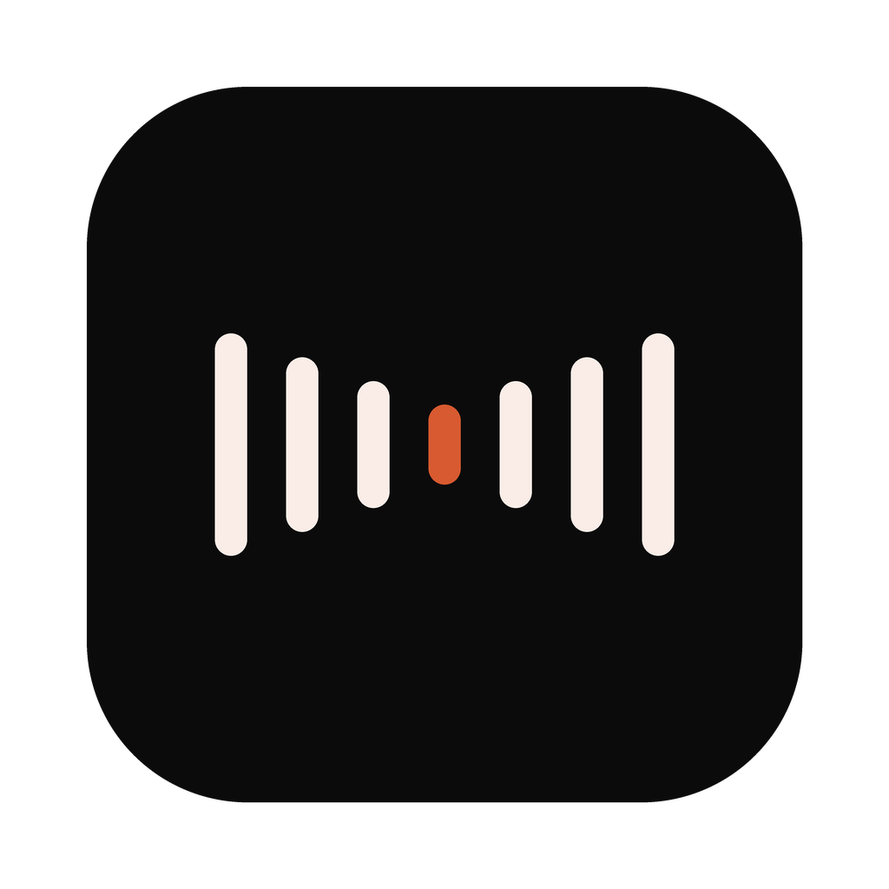
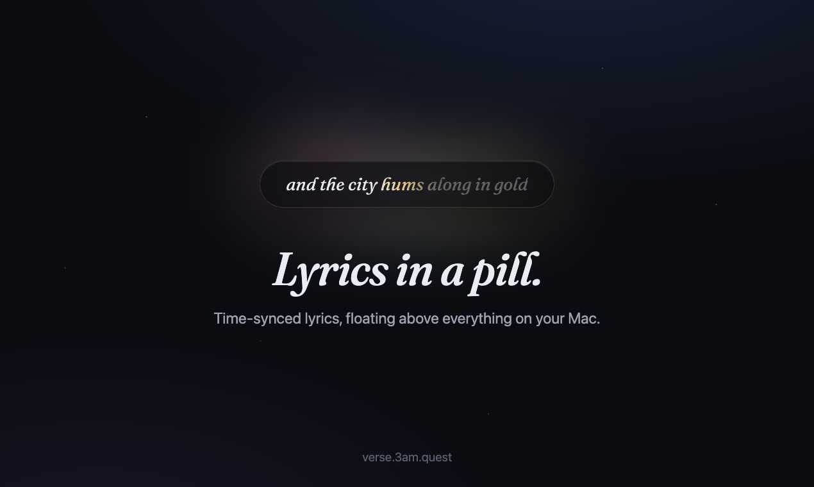
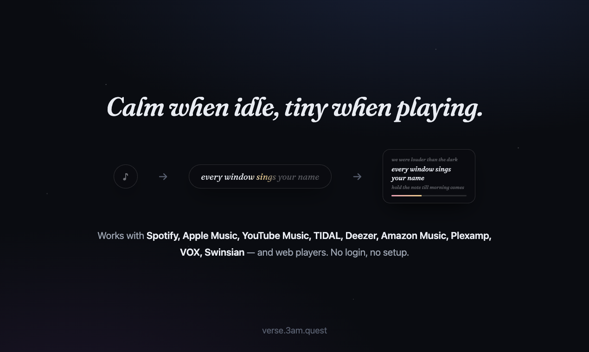
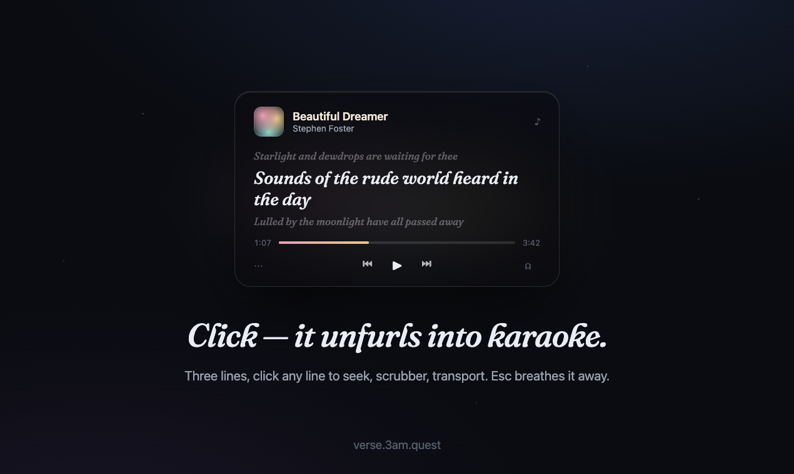
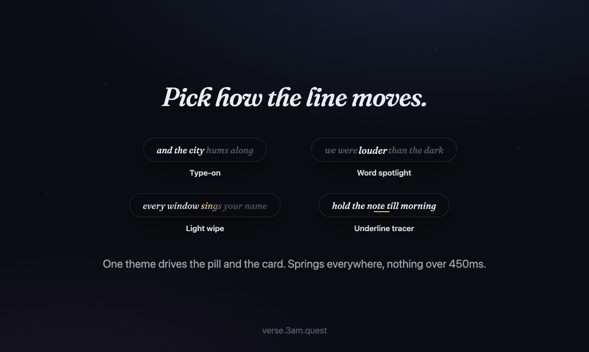

<p align="center">
  
</p>

<h1 align="center">Verse</h1>
<p align="center"><em>Lyrics in a pill.</em></p>

<p align="center">
  <a href="https://verse.3am.quest"></a>
  <a href="https://github.com/cpt-nem0/verse/releases/latest"></a>
  
  
  
</p>

<p align="center">
  <a href="https://verse.3am.quest">
    
  </a>
</p>

Verse shows time-synced lyrics for whatever's playing, in a slim, draggable
glass pill that floats above every app — always on top, never in the way.
Click it and it unfurls into a translucent karaoke card. Calm when idle, tiny
when playing, beautiful when you want it. Works on every Mac.

**Try it before installing:** the pill on [verse.3am.quest](https://verse.3am.quest)
is a live recreation — drag it around the page, click it, scrub it.

<!-- TODO: drag a 20-30s screen recording here via the GitHub web editor —
     a real capture beats every image below. -->

## Install

**Homebrew** — one line, installs and launches with no Gatekeeper prompt:

```sh
brew install --cask cpt-nem0/tap/verse
```

**Or the install script** — same zero-prompt experience:

```sh
curl -fsSL https://raw.githubusercontent.com/cpt-nem0/verse/main/install.sh | bash
```

**Or manually**: download `Verse.zip` from
[Releases](https://github.com/cpt-nem0/verse/releases/latest), unzip into
`/Applications`, and clear the quarantine flag Gatekeeper stamps on browser
downloads (Verse is ad-hoc signed, not notarized):

```sh
xattr -cr /Applications/Verse.app
```

(Or open it once via System Settings → Privacy & Security → **Open Anyway**.)

## The pill, the card

<p align="center">
  
</p>

- **A ball when idle, a pill when singing.** No music → a tiny translucent
  ball parked wherever you left it, at near-zero CPU. Music playing → a
  capsule that hugs the current lyric line, spring-animated as it changes.
- **Click to unfurl.** One click opens a glass karaoke card: three lyric
  lines, click any line to seek, plus a scrubber and transport controls.

<p align="center">
  
</p>

- **Lives on any display.** Right-click → Screen sends the pill to another
  monitor; it remembers which display it lives on, falls back gracefully when
  you unplug, and comes back when you re-plug.
- **Edge-anchored growth.** The pill remembers which screen edge you parked
  it on and grows away from that edge as lines change width.
- **Techie glass.** Translucent black material everywhere; the album's
  dominant color tints only the lyric text, never the material. Echoes and
  ad-libs — the parenthesis parts — render soft, small, and italic.
- **Zero setup.** Detects whatever's playing automatically — no accounts, no
  configuration.

## Four themes

<p align="center">
  
</p>

One setting drives the animation in both the pill and the card, expressive →
minimal: **Type-on**, **Word spotlight**, **Light wipe** (default), and
**Underline tracer**. Springs everywhere, nothing over 450ms, and everything
respects Reduce Motion.

## Supported sources

Spotify, Apple Music, YouTube Music (app or web), TIDAL, Deezer, Amazon
Music, Plexamp, VOX, Swinsian — plus web players in supported browsers when
the tab publishes real music metadata (artist and album, not just a video
title).

## How it works

Lyrics come from [LRCLIB](https://lrclib.net)'s free, open catalog, matched
on title/artist/album/duration and cached on disk so repeat plays render
offline. Now-playing data comes from the community
[`mediaremote-adapter`](https://github.com/ungive/mediaremote-adapter) helper
(MediaRemote access has been restricted since macOS 15.4), with an
AppleScript polling fallback; a local playback clock interpolates between
updates so the animation stays smooth between polls.

## Building from source

Requirements: macOS 14+, Xcode command line tools, `cmake` (`brew install
cmake`), `git`.

```sh
chmod +x build.sh   # first time only
./build.sh run
```

The script clones and builds `mediaremote-adapter`, builds the Swift package
in release mode, and assembles + ad-hoc signs `build/Verse.app`. Other
commands: `./build.sh` (build only), `./build.sh install` (copy to
`/Applications`), `./build.sh clean`.

Checks (no XCTest target; pure logic is covered by self-contained checks):

```sh
swift run Verse --checks   # expect ALL CHECKS PASSED
```

## Credits

- Lyrics from [LRCLIB](https://lrclib.net) — a free, open, crowd-sourced
  synced-lyrics database.
- Now-playing access via [`mediaremote-adapter`](https://github.com/ungive/mediaremote-adapter)
  by [ungive](https://github.com/ungive) (BSD-3).

## License

MIT — see [LICENSE](LICENSE).
